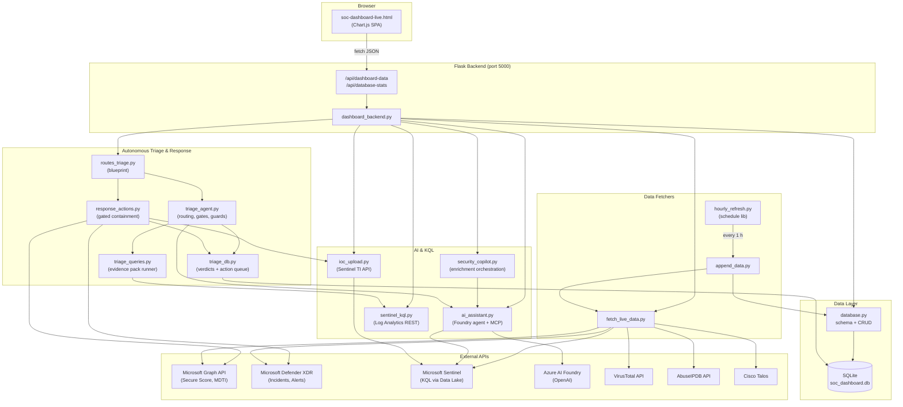
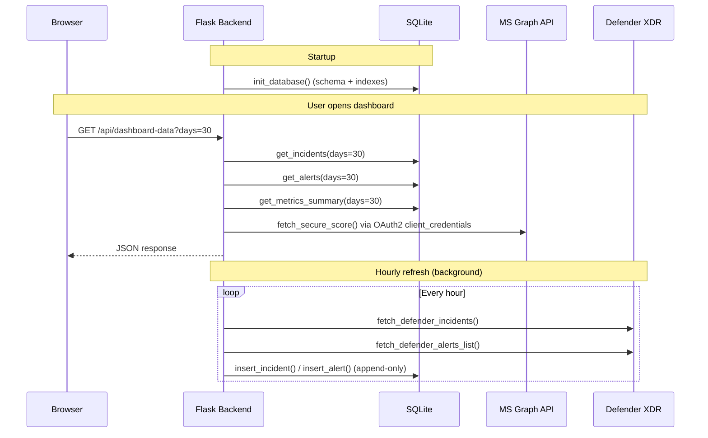
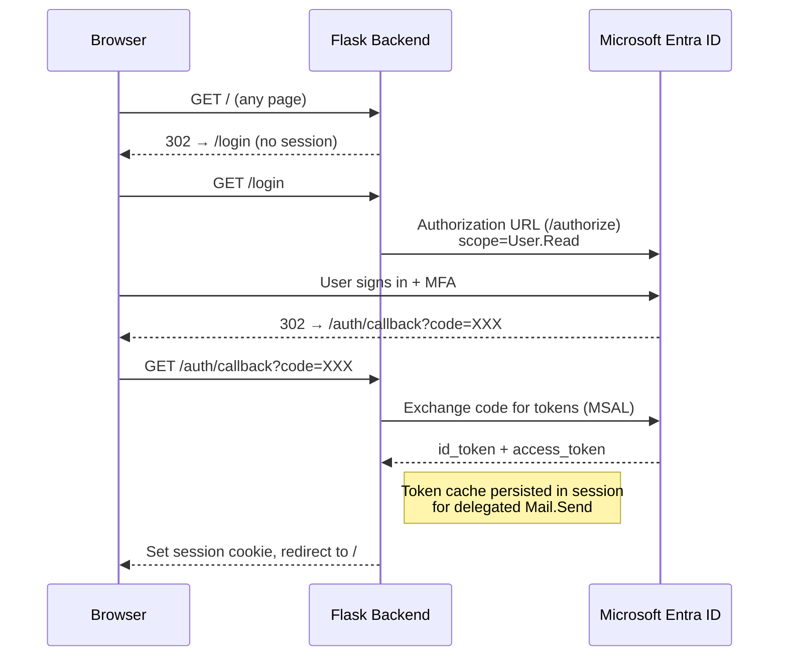
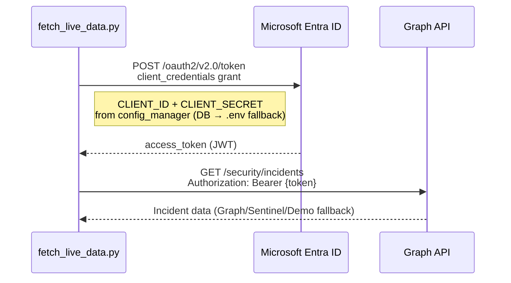

# Architecture — SOC Dashboard for Microsoft Defender XDR

## Overview

The SOC Dashboard is a Python/Flask web application that aggregates security data
from Microsoft Defender XDR, Microsoft Sentinel, and third-party threat intelligence
feeds into a single-pane-of-glass view for SOC analysts.

## Component Diagram



## Data Flow



## Authentication Flow

### User Login (Entra ID — OAuth2 Authorization Code Flow)



Logout clears the Flask-Session cookie and redirects through the Entra ID
`/oauth2/v2.0/logout` endpoint. The post-logout landing page is `/logged-out`,
derived from `REDIRECT_URI` unless `POST_LOGOUT_REDIRECT_URI` is set.

- Multi-tenant: authority = `https://login.microsoftonline.com/common`
- Delegated scopes: `User.Read`, `Mail.Send` — consented at login
- Admin access: Entra app role (configurable name, default `Admin`) checked by `@require_admin` decorator
- Sessions: Flask-Session (filesystem), 8-hour lifetime, SameSite=Lax
- Escalation email: sent via `/me/sendMail` using the user's delegated token (not client_credentials) — the app can only send as the logged-in user
- Escalation Teams notification: sent via Microsoft Teams Incoming Webhook or Power Automate Workflows connector (`TEAMS_WEBHOOK_URL` config). Adaptive Card format with incident details and Defender Portal link. No OAuth required — webhook URL is treated as a secret and encrypted at rest.

### Backend API Auth (Client Credentials — Machine-to-Machine)



## Configuration System

All credentials and settings are managed through `config_manager.py` with two-tier lookup:
1. **SQLite `config` table** (set via Settings UI, encrypted for secrets)
2. **Environment variables** (`.env` file, fallback)

- Encryption: Fernet (AES-128-CBC) via `cryptography` library
- Key file: auto-generated at `CONFIG_KEY_PATH` (default: `config.key`)
- Secrets (CLIENT_SECRET, VIRUSTOTAL_API_KEY, etc.) are encrypted at rest in the DB
- Settings UI accessible to admin users only

## Database Schema (SQLite)

| Table | Purpose | Key Columns |
|-------|---------|-------------|
| `incidents` | Defender/Sentinel incidents | id (PK), title, severity, status, created_time, data (JSON) |
| `alerts` | Alerts linked to incidents | id (PK), incident_id (FK), title, severity, timestamp, data (JSON) |
| `entities` | IOC entities from incidents | incident_id (FK), entity_type, entity_name, verdict |
| `threat_intel_snapshots` | Point-in-time TI data | timestamp, source, data (JSON) |
| `metrics_snapshots` | Dashboard metrics over time | timestamp, secure_score, severity counts |
| `config` | App configuration & encrypted secrets | key (PK), value, is_encrypted, updated_at |
| `attack_stories` | Cached AI-generated incident analyses | incident_id (PK), story (TEXT), model, created_at |
| `cases` | Analyst-created investigation cases | id (PK), incident_id, title, notes, status, created_by, created_at |
| `incident_enrichments` | Security Copilot enrichment results | id (AI PK), incident_id (FK), source, risk_score, summary, recommended_actions (JSON), entity_reputations (JSON), copilot_session_id, model, created_at |
| `incident_triage` | Autonomous triage verdicts, newest wins | id (AI PK), incident_id (FK), verdict, confidence, evidence_grade, risk_score, severity_assessment, suggested_classification, suggested_determination, summary, mitre (JSON), rca (JSON), recommended_actions (JSON), entity_reputations (JSON), investigation_trace (JSON), model, model_tier, routing_reason, source, raw_response, created_at |
| `response_actions` | Proposed / approved / executed containment actions | id (AI PK), incident_id (FK), triage_id (FK), action_type, target_type, target_value, resolved_target_id, reason, status, dry_run, requested_by, decided_by, result_message, api_status_code, created_at, decided_at, executed_at |

### Indexes
- `idx_incidents_created` — fast date range queries
- `idx_incidents_severity` / `idx_incidents_status` — filter queries
- `idx_alerts_incident` / `idx_alerts_timestamp` — join + range
- `idx_entities_incident` / `idx_entities_type` — entity lookups
- `idx_enrichments_incident` / `idx_enrichments_created` — enrichment lookups
- `idx_triage_incident` / `idx_triage_created` / `idx_triage_verdict` — triage lookups + stats
- `idx_actions_incident` / `idx_actions_status` / `idx_actions_created` — approval queue

### `investigation_trace`

`incident_triage.investigation_trace` is the audit record behind a verdict: every
evidence query with its row count and status, the agent tool calls, the four verdict
gate answers, which gates passed or failed, and every guard adjustment applied. It is
what lets an analyst — or a customer's auditor — see which query produced which
finding months later. See [AUTONOMOUS_TRIAGE.md](AUTONOMOUS_TRIAGE.md) §6.

## Incident Actions & Comment Posting

The dashboard can write back to Defender XDR via the Graph Security API:

| Action | Graph Endpoint | Notes |
|--------|----------------|-------|
| Assign | `PATCH /security/incidents/{id}` | Sets `assignedTo` field |
| Escalate | `PATCH /security/incidents/{id}` | Bumps severity + adds `Escalated` tag |
| Close | `PATCH /security/incidents/{id}` | Sets `status=resolved` + classification |
| Comment | `POST /security/incidents/{id}/comments` | **Max 1000 chars** — truncated automatically |

### Response Actions (gated)

Separate from the actions above: these change state on a production asset and are
never executed by triage itself. Each is recorded as a proposal, requires an admin
approval call, is gated by its own `RESPONSE_ALLOW_*` flag re-checked at execution,
and is a no-op recorded as `simulated` while `RESPONSE_DRY_RUN` is on (the default).

| Action | Endpoint | Permission |
|--------|----------|------------|
| Isolate device | `POST {mde}/machines/{id}/isolate` | Machine.Isolate |
| Revoke sessions | `POST /users/{id}/revokeSignInSessions` | User.RevokeSessions.All |
| Disable account | `PATCH /users/{id}` → `accountEnabled: false` | User.ReadWrite.All |
| Push indicator | Sentinel TI `createIndicator` (via `ioc_upload.py`) | Microsoft Sentinel Contributor |
| Close as FP | `PATCH /security/incidents/{id}` | SecurityIncident.ReadWrite.All |

Targets are resolved against the live MDE machine inventory and Entra directory; an
ambiguous or missing match fails the action rather than guessing. The audit comment
posted back to the incident states the real outcome — success, failure or dry run.

**Graph comment limit:** The Graph Security API enforces a **1000-character maximum** per comment.
`graph_post_comment()` in `fetch_live_data.py` truncates to 1000 chars as a safety net.
AI Analysis and Copilot Enrichment comments are pre-truncated (summary ≤960/700 chars respectively)
before posting.

## Logging

Flask's `app.logger` is wired to gunicorn's error handler at startup:
```python
_gunicorn_logger = logging.getLogger('gunicorn.error')
if _gunicorn_logger.handlers:
    app.logger.handlers = _gunicorn_logger.handlers
    app.logger.setLevel(_gunicorn_logger.level)
```
Without this, `app.logger.info()` and `app.logger.warning()` calls are invisible
under gunicorn because Flask's default logger has no handler attached.
All application-level logs appear in `/var/log/soc-dashboard/error.log`.

## Technology Stack

| Layer | Technology |
|-------|------------|
| Frontend | Vanilla HTML/CSS/JS, Chart.js 4.4 |
| Backend | Python 3, Flask 3.1, Flask-CORS, Flask-Session |
| Database | SQLite 3 (file-based) |
| Auth (user) | MSAL 1.31 (authorization code flow, multi-tenant) |
| Auth (API) | MSAL 1.31 (client_credentials) |
| Encryption | cryptography (Fernet) for config secrets |
| HTTP | requests 2.32 |
| Scheduler | schedule 1.2 / systemd timer (production) |
| AI | Azure AI Foundry (OpenAI), azure-identity, Sentinel MCP tools |
| Enrichment | Security Copilot (via Foundry agent), AI Analysis (direct) |
| Triage | Autonomous verdicts with a YAML evidence query pack (pyyaml 6.0) |
| Response | Defender for Endpoint API, Microsoft Graph, Sentinel TI — all behind approval gates |
| KQL | Log Analytics REST API (ad-hoc queries from frontend) |
| Config | python-dotenv 1.0 |
| WSGI | gunicorn (production) |
| Reverse Proxy | nginx with TLS |

## Production Deployment Topology

> The diagram below is a **reference example**. Adjust IPs, domain names, and
> infrastructure components to match your own environment.

```mermaid
graph LR
    subgraph "Client Network"
        BROWSER["Browser"]
    end

    subgraph "DNS"
        DNS["your-domain.com<br/>→ LXC or Proxy IP"]
    end

    subgraph "Optional: Reverse Proxy"
        SNI["nginx stream<br/>SNI router :443"]
    end

    subgraph "Dashboard LXC (Ubuntu 24.04)"
        NGINX["nginx :443<br/>TLS termination"]
        GUNICORN["gunicorn :5000<br/>2 workers"]
        FLASK["dashboard_backend.py"]
        SQLITE[(SQLite<br/>/var/lib/soc-dashboard/)]
        TIMER["systemd timer<br/>hourly-refresh"]
        FETCH["append_data.py"]
    end

    subgraph "External APIs"
        MSAPI["Microsoft Graph<br/>Defender XDR<br/>Sentinel"]
        TI["VirusTotal<br/>AbuseIPDB<br/>Talos"]
    end

    BROWSER -->|"HTTPS"| DNS
    DNS --> SNI
    SNI -->|"proxy_protocol"| NGINX
    NGINX -->|"HTTP"| GUNICORN
    GUNICORN --> FLASK
    FLASK --> SQLITE

    TIMER -->|"every 1h"| FETCH
    FETCH --> SQLITE
    FETCH --> MSAPI
    FETCH --> TI
```

### systemd Service Architecture

| Unit | Type | Purpose |
|------|------|---------|
| `dashboard.service` | notify (gunicorn) | Flask API + HTML serving, 2 workers, bound to 127.0.0.1:5000 |
| `hourly-refresh.service` | oneshot | Single data fetch run via `append_data.py` |
| `hourly-refresh.timer` | timer | Triggers refresh every hour (OnBootSec=2min, OnUnitActiveSec=1h) |

### Infrastructure Details

> Adjust these values for your deployment.

| Component | Detail |
|-----------|--------|
| Dashboard LXC | Ubuntu 24.04, your LXC IP, in DMZ or appropriate network segment |
| Reverse Proxy (optional) | nginx stream block with SNI routing + proxy_protocol |
| DNS | Point your domain to the proxy (if used) or LXC directly |
| TLS | Let's Encrypt via certbot, ACME challenge on port 80 |
| Service user | `socdash` — no-login system user, owns DB + .env |

## Deployment Notes

- **Production deployment** uses gunicorn behind nginx with TLS
- **Proxy protocol** — `nginx_site.conf` includes `proxy_protocol` on `listen 443` by default (for upstream SNI proxy). If deploying **without** a proxy, remove `proxy_protocol` from listen directives and delete the `set_real_ip_from` / `real_ip_header` lines.
- **`UPSTREAM_PROXY_IP`** — set this in `.env` to your SNI proxy's IP (e.g. `10.0.0.1`). `deploy_lxc.sh` uses it to auto-configure `proxy_protocol` + `set_real_ip_from`. Omitting it generates a direct-TLS config.
- **NEVER run `certbot --nginx`** behind a proxy_protocol proxy — it rewrites listen directives and removes `proxy_protocol`, causing `ERR_SSL_PROTOCOL_ERROR`. Use `certbot certonly --webroot` instead.
- **deploy_lxc.sh preserves existing nginx HTTPS config** — if `listen 443 ssl` already exists in the config file, it will not be overwritten. This prevents accidental TLS breakage on re-deploy.
- **gunicorn `--capture-output`** — required in the systemd ExecStart line for `app.logger` output to reach the error log file. Without it, only gunicorn lifecycle messages appear.
- **Flask logger wiring** — `app.logger` must be wired to `gunicorn.error` handlers at startup (see Logging section above). Without this, `app.logger.info()` calls silently go nowhere.
- **Graph comment limit** — The Graph Security API enforces a 1000-character limit per comment. `graph_post_comment()` auto-truncates but callers should also pre-truncate to avoid cutting mid-sentence.
- **SQLite limits** — append-only model; gunicorn workers + hourly timer can cause `database is locked` under load. Consider WAL mode.
- **Credentials** — all via `.env` file (chmod 600); never in source control
- **Dashboard authentication** — Entra ID login required (OAuth2 authorization code flow, multi-tenant)
- **Admin access** — Entra app role (configurable, default `Admin`) required for settings page
- **Config encryption** — Secrets stored in SQLite `config` table are Fernet-encrypted; key stored at `CONFIG_KEY_PATH`

### Update Workflow

Two deployment paths are supported:

**Git-based (recommended):** `scripts/update_from_git.sh`
1. First run: clones the repo into `/opt/soc-dashboard`
2. Subsequent runs: `git pull --ff-only`, stashing local hotfixes first
3. Updates pip deps if `requirements.txt` changed
4. Restarts `dashboard.service` and verifies health
5. Reloads nginx if `nginx_site.conf` changed (with `nginx -t` validation)
6. Flags: `--branch <name>`, `--no-restart`, `--full-deploy` (re-runs `deploy_lxc.sh`)

**SCP-based:** Copy changed files manually, restart service. No git required on the server.
